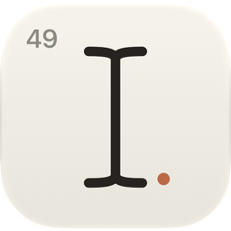
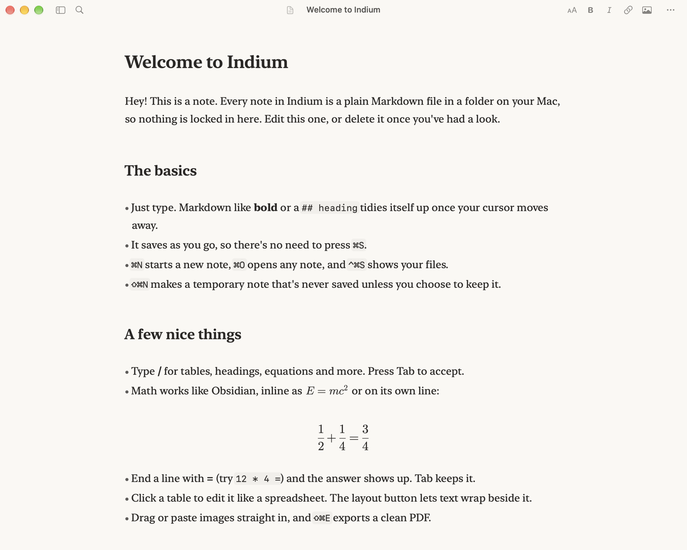

<div align="center">
  
  <h1>Indium</h1>
  <p>A lean, open source Markdown editor for the Mac.<br />One note at a time, just for writing.</p>
  <p>
    <a href="https://github.com/LegendarySpy/Indium/releases/latest">Download</a> ·
    <a href="#building">Build it yourself</a> ·
    <a href="https://github.com/LegendarySpy/Indium/issues">Issues</a>
  </p>
  <p>
    <a href="https://github.com/LegendarySpy/Indium/releases/latest">
      
    </a>
  </p>
</div>

---

Indium is a softer, quieter take on Obsidian. I love Obsidian, but it can feel overwhelming and very full at times, and I wanted something simple that's built for taking notes.

So Indium shows one screen at a time. There are no tabs, split views, or sidebars, just the note you're writing. It's a small native Mac app with full Markdown and LaTeX math, and it opens your Obsidian vault as is. Your notes stay plain `.md` files in a folder, so you can go back and forth whenever you like.

<p align="center">
  
</p>

## What's in it

- **Plain files.** Every note is a Markdown file on disk. No database, no lock-in.
- **Syntax that steps aside.** Markdown tidies itself up once your cursor leaves a line.
- **Real math.** `$inline$` and `$$display$$` equations like Obsidian, typeset natively in the editor and in PDFs.
- **Quick answers.** End a line with `=` and the answer shows up. Tab keeps it.
- **Tables you can click.** Edit cells directly, add rows and columns, drag to resize.
- **Text beside tables and images.** Let writing wrap around a table, or put two blocks side by side.
- **Slash commands.** Type `/` for tables, headings, equations, and more.
- **Temporary notes.** A scratch note that's never saved unless you keep it.
- **Live updates.** If another app or an AI agent edits a note, you see it as it happens.
- **Quick Look.** Press Space on a note in Finder to see it rendered.
- **PDF export.** Clean pages in light or dark.

## Roadmap

A soft list of what I'd like to add, in no particular order:

- Backlinks for `[[wiki links]]`, shown quietly at the bottom of a note
- More export options, like HTML and Word
- Callouts and footnotes, the way Obsidian writes them

What it won't have: a graph view or a plugin store. Indium is meant to stay small.

## Install

Grab the latest zip from [Releases](https://github.com/LegendarySpy/Indium/releases/latest), unzip it, and drag Indium to Applications. It keeps itself up to date after that.

## Building

You'll need Xcode 26 and [XcodeGen](https://github.com/yonaskolb/XcodeGen).

```sh
brew install xcodegen
xcodegen generate
open Indium.xcodeproj
```

Pushing a tag like `v1.1` runs the [release workflow](.github/workflows/release.yml), which builds the app, signs and notarizes it, and publishes the update for Sparkle. [`Scripts/release.sh`](Scripts/release.sh) does the same thing locally.

## Acknowledgments

- [SwiftMath](https://github.com/mgriebling/SwiftMath) (MIT), math typesetting, vendored with a few fixes
- [Latin Modern Math](https://www.gust.org.pl/projects/e-foundry/lm-math) (GUST Font License), the math font
- [Sparkle](https://sparkle-project.org/) (MIT), updates

## License

Indium is open source under the [GNU AGPL-3.0](LICENSE). You can use, change, and share it freely, as long as changes you distribute stay open under the same license. The Indium name and icon aren't covered, so forks need their own.
