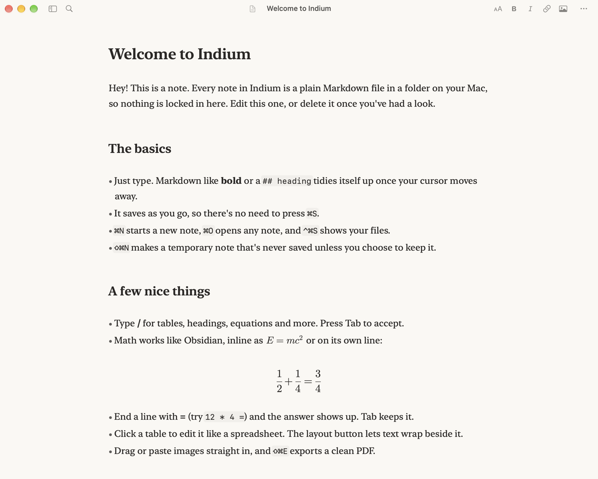

<div align="center">
  
  <h1>Indium</h1>
  <p>A lean, open source Markdown editor for the Mac.<br />One note at a time, just for writing.</p>
  <p>
    <a href="https://github.com/LegendarySpy/Indium/releases/latest">Download</a> ·
    <a href="#building">Build it yourself</a> ·
    <a href="https://github.com/LegendarySpy/Indium/issues">Issues</a>
  </p>
  <p>
    <a href="https://github.com/LegendarySpy/Indium/releases/latest">
      
    </a>
  </p>
</div>

---

Indium is a softer, quieter take on Obsidian. I love Obsidian, but it can feel overwhelming and very full at times, and I wanted something simple that's built for taking notes.

So Indium shows one note at a time. There are no tabs or split views, just the note you're writing and, when you want it, a sidebar with your files. It's a small native Mac app with full Markdown and LaTeX math, and it opens your Obsidian vault as is. Your notes stay plain `.md` files in a folder, so you can go back and forth whenever you like.

<p align="center">
  
</p>

## What's in it

- **Plain files.** Every note is a Markdown file on disk. No database, no lock-in.
- **Syntax that steps aside.** Markdown tidies itself up once your cursor leaves a line.
- **Real math.** `$inline$` and `$$display$$` equations like Obsidian, typeset natively in the editor and in PDFs.
- **Math shortcuts.** Type `mk` for an equation, `x/` for a fraction, `sr` to square, `@a` for α. Tab moves to the next blank, like Obsidian's LaTeX Suite.
- **Your own shortcuts.** Put a `.indium/snippets.json` in your notes folder, written the way LaTeX Suite writes snippets. You can paste them straight from Obsidian.
- **Quick answers.** End a line with `=` and the answer shows up. Tab keeps it.
- **Tables you can click.** Edit cells directly, add rows and columns, drag to resize.
- **Math in tables.** Write `$…$` in a cell with the same shortcuts as everywhere else.
- **Table formulas.** Work out a row or column from the others, written as Advanced Tables formulas so Obsidian can read them. They can use units, significant figures, and numbers from the note's frontmatter.
- **Text beside tables and images.** Let writing wrap around a table, or put two blocks side by side.
- **Obsidian's extras.** Callouts, embedded notes (`![[Note]]`), `#tags`, `%% comments %%` and footnotes, drawn the way Obsidian draws them.
- **Slash commands.** Type `/` for tables, headings, equations, and more.
- **Temporary notes.** A scratch note that's never saved unless you keep it.
- **Live updates.** If another app or an AI agent edits a note, you see it as it happens.
- **Note icons.** Apple Intelligence picks an icon for each note, on your Mac. Ask for another and it tells you when it kept the same one, or why it couldn't.
- **Quick Look.** Press Space on a note in Finder to see it rendered.
- **PDF export.** Clean pages in light or dark. Turn on page lines to see where pages break, or type `/page break` to start a new one.

For what carries over from Obsidian and what doesn't, see [Compatibility](COMPATIBILITY.md).

## Roadmap

A soft list of what I'd like to add, in no particular order:

- Backlinks for `[[wiki links]]`, shown quietly at the bottom of a note
- More export options, like HTML and Word

What it won't have: a graph view or a plugin store. Indium is meant to stay small.

## Install

Grab the latest zip from [Releases](https://github.com/LegendarySpy/Indium/releases/latest), unzip it, and drag Indium to Applications. It keeps itself up to date after that.

## Building

You'll need Xcode 26 and [XcodeGen](https://github.com/yonaskolb/XcodeGen).

```sh
brew install xcodegen
xcodegen generate
open Indium.xcodeproj
```

There's also an App Store edition (the `IndiumMAS` scheme): sandboxed, without Sparkle. [`Scripts/archive-mas.sh`](Scripts/archive-mas.sh) archives it and exports it to a folder. It never uploads anything.

Pushing a tag like `v1.1` runs the [release workflow](.github/workflows/release.yml), which builds the app, signs and notarizes it, and publishes the update for Sparkle. [`Scripts/release.sh`](Scripts/release.sh) does the same thing locally.

## Acknowledgments

- [SwiftMath](https://github.com/mgriebling/SwiftMath) (MIT), math typesetting, vendored with a few fixes
- [Latin Modern Math](https://www.gust.org.pl/projects/e-foundry/lm-math) (GUST Font License), the math font
- [Sparkle](https://sparkle-project.org/) (MIT), updates (not in the App Store edition)
- [Obsidian LaTeX Suite](https://github.com/artisticat1/obsidian-latex-suite) (MIT), whose snippets the default math shortcuts are adapted from

## License

Indium is open source under the [GNU AGPL-3.0](LICENSE). You can use, change, and share it freely, as long as changes you distribute stay open under the same license. The Indium name and icon aren't covered, so forks need their own.
